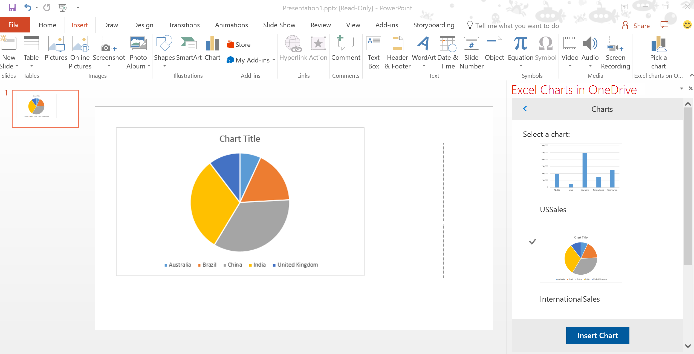

# 在 PowerPoint 外接程序中使用 Microsoft Graph 插入 Excel 图表 

了解如何构建连接到 Microsoft Graph 的 Microsoft Office 外接程序，查找存储在 OneDrive for Business 中的所有工作簿，使用 Excel REST API 提取工作簿中的所有图表，以及使用 Office.js 将图表的图像插入到 PowerPoint 幻灯片中。

## 简介

集成来自联机服务提供程序的数据可提高外接程序的价值和采用率。此代码示例演示了如何将外接程序连接到 Microsoft Graph。使用此代码示例可执行以下操作：

* 从 Office 外接程序连接到 Microsoft Graph。
* 在外接程序中使用 OAuth 2.0 授权框架。
* 从 Microsoft Graph 中使用 Excel 和 OneDrive REST API。
* 使用 Office UI 命名空间显示对话框。
* 使用 ASP.NET MVC 和 Office.js 构建外接程序。 
* 在 PowerPoint 中使用外接程序命令。

## 先决条件
必须符合以下条件才能运行此代码示例。

* Visual Studio 2015。

* Office 365 帐户，获取方法为加入 [Office 365 开发人员计划](https://aka.ms/devprogramsignup)，其中包含为期 1 年的免费 Office 365 订阅。

* 在 Office 365 订阅的 OneDrive for Business 中存储的 Excel 工作簿（含图表）。

* PowerPoint for Windows Desktop 版本 16.0.6769.2001 或更高版本。
* [Office 开发人员工具](https://www.visualstudio.com/en-us/features/office-tools-vs.aspx)

* Microsoft Azure 租户。此外接程序需要 Azure Active Directory (AD)。Azure AD 为应用程序提供了用于进行身份验证和授权的标识服务。你还可在此处获得试用订阅：[Microsoft Azure](https://account.windowsazure.com/SignUp)。

## 配置项目

1. 在 **Visual Studio** 中，选择 **PowerPoint-Add-in-Microsoft-Graph-ASPNET-InsertChartWeb** 项目。在“**属性**”中，确保“**已启用 SSL**”为“**True**”。验证 **SSL URL** 使用的域名和端口号与下面步骤 3 中列出的相同。
 
2. 确保你的 Azure 订阅已绑定到 Office 365 租户。有关详细信息，请参阅 Active Directory 团队的博客文章 [Creating and Managing Multiple Windows Azure Active Directories](http://blogs.technet.com/b/ad/archive/2013/11/08/creating-and-managing-multiple-windows-azure-active-directories.aspx)（创建和管理多个 Microsoft Azure Active Directory）。“**添加新目录**”一节将介绍如何执行此操作。你还可以参阅 [Set up your Office 365 development environment](https://msdn.microsoft.com/office/office365/howto/setup-development-environment#bk_CreateAzureSubscription)（设置 Office 365 开发环境）和“**关联你的 Office 365 帐户和 Azure AD 以创建并管理应用**”一节获取详细信息。

3. 使用 [Azure 管理门户](https://manage.windowsazure.com)注册你的应用程序。若要了解如何注册你的应用程序，请参阅 [Register your browser-based web app with the Azure Management Portal](https://msdn.microsoft.com/office/office365/HowTo/add-common-consent-manually#bk_RegisterWebApp)（在 Azure 管理门户中注册基于浏览器的 Web 应用）。使用以下设置：

 - 登录 URL：https://localhost:44301/AzureADAuth/Authorize 
 - 应用 ID URI：https://localhost:44301
 - 回复 URL：https://localhost:44301/AzureADAuth/Authorize 

    > 注意：注册你的应用程序后，复制 Azure 管理门户中显示的客户端 ID 和客户端密码。
     
4. 向应用授予权限。
    *  在 Azure 管理门户中，选择“Active Directory”****选项卡和 Office 365 租户。
    *  选择“应用”****选项卡，再单击要配置的应用。选择“配置”****。
    *  在“授予其他应用的权限”****中，添加“Microsoft Graph”****。
    *  在“委派权限”****中，选择“读取用户文件以及与用户共享的文件”****。

5.  在 web.config 中，将“AAD:ClientID”****设置为客户端 ID，并将“AAD:ClientSecret”****设置为客户端密码。 

## 运行项目
1. 打开 Visual Studio 解决方案文件。 
2. 右键单击“PowerPoint-Add-in-Microsoft-Graph-ASPNET-InsertChart”****，再选择“设为启动项目”****。
2. 按 F5。 
3. 在 PowerPoint 中，依次选择“插入”**** > “选取图表”****，打开任务窗格加载项。

## 已知问题

* 应用场景：当尝试运行该代码示例时，外接程序不会加载。
    * 解决方案： 
        1. 在 Visual Studio 中，打开“SQL Server 对象资源管理器”****。
        2. 依次展开“(localdb)\MSSQLLocalDB”**** > “数据库”****
        3. 右键单击“PowerPoint-Add-in-Microsoft-Graph-ASPNET-InsertChart”****，再选择“删除”****。 
* 应用场景：运行代码示例时，*Office.context.ui.messageParent* 行出错。   
    * 解决方案：停止运行该代码示例并重启它。 
* 如果下载 zip 文件，当提取文件时出错，指示该文件路径太长。
    * 解决方案：将文件直接解压缩到根目录下的文件夹中（例如 c:\sample）。

## 问题和意见
我们希望得到你对“*在 PowerPoint 外接程序中使用 Microsoft Graph 插入 Excel 图表*”示例的相关反馈。你可以在该存储库中的“*问题*”部分将反馈发送给我们。与 Office 365 开发相关的问题一般应发布到 [Stack Overflow](http://stackoverflow.com/questions/tagged/Office365+API)。确保你的问题使用了 [office-js]、[MicrosoftGraph] 和 [API] 标记。

## 其他资源

* [Microsoft Graph (Excel) ToDo 代码示例](https://github.com/OfficeDev/Microsoft-Graph-ASPNET-ExcelREST-ToDo)
* [Microsoft Graph 文档](https://graph.microsoft.io/en-us/docs)
* [Office 加载项文档](https://dev.office.com/docs/add-ins/overview/office-add-ins)
* 查看 //Build 视频 - [Office 平台概述](https://channel9.msdn.com/Events/Build/2016/B872 "Office 平台概述")。

## 版权
版权所有 (c) 2016 Microsoft Corporation。保留所有权利。

此项目已采用 [Microsoft 开放源代码行为准则](https://opensource.microsoft.com/codeofconduct/)。有关详细信息，请参阅[行为准则 FAQ](https://opensource.microsoft.com/codeofconduct/faq/)。如有其他任何问题或意见，也可联系 [opencode@microsoft.com](mailto:opencode@microsoft.com)。
