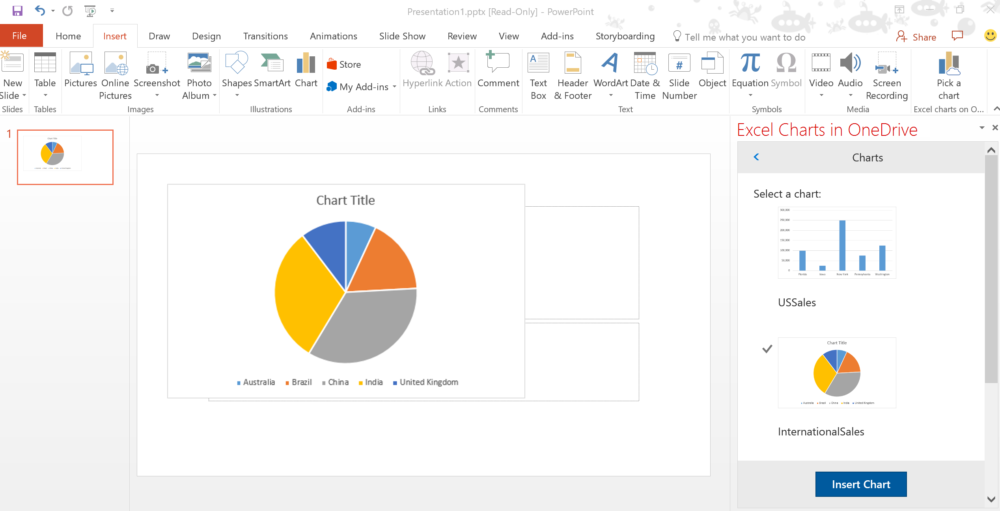

# Insert Excel charts using Microsoft Graph in a PowerPoint Add-in 

Learn how to build a Microsoft Office Add-in that connects to Microsoft Graph, finds all workbooks stored in OneDrive for Business, fetches all charts in the workbooks using the Excel REST APIs, and inserts an image of a chart into a PowerPoint slide using Office.js.

## Introduction

Integrating data from online service providers increases the value and adoption of your add-ins. This code sample shows you how to connect your add-in to Microsoft Graph. Use this code sample to:

* Connect to Microsoft Graph from an Office Add-in.
* Use the OAuth 2.0 authorization framework in an add-in.
* Use the Excel and OneDrive REST APIs from Microsoft Graph.
* Show a dialog using the Office UI namespace.
* Build an Add-in using ASP.NET MVC and Office.js. 
* Use add-in commands in PowerPoint.

## Prerequisites
To run this code sample, the following are required.

* Visual Studio 2015.

* An Office 365 account which you can get by joining the [Office 365 Developer Program](https://profile.microsoft.com/RegSysProfileCenter/wizardnp.aspx?wizid=14b845d0-938c-45af-b061-f798fbb4d170&lcid=1033) that includes a free 1 year subscription to Office 365.

* Excel workbooks (with charts) stored on OneDrive for Business in your Office 365 subscription.

* PowerPoint for Windows Desktop, version 16.0.6769.2001 or higher.
* [Office Developer Tools](https://www.visualstudio.com/en-us/features/office-tools-vs.aspx)

* A Microsoft Azure Tenant. This add-in requires Azure Active Directiory (AD). Azure AD provides identity services that applications use for authentication and authorization. A trial subscription can be acquired here: [Microsoft Azure](https://account.windowsazure.com/SignUp).

## Configure the project

1. In **Visual Studio**, choose the **PowerPoint-Add-in-Microsoft-Graph-ASPNET-InsertChartWeb** project. In **Properties**, ensure **SSL Enabled** is **True**. Verify that the **SSL URL** uses the same domain name and port number as those listed in step 3 below.
 
2. Ensure your Azure subscription is bound to your Office 365 tenant. For more information, see the Active Directory team's blog post, [Creating and Managing Multiple Windows Azure Active Directories](http://blogs.technet.com/b/ad/archive/2013/11/08/creating-and-managing-multiple-windows-azure-active-directories.aspx). The section **Adding a new directory** will explain how to do this. You can also see [Set up your Office 365 development environment](https://msdn.microsoft.com/office/office365/howto/setup-development-environment#bk_CreateAzureSubscription) and the section **Associate your Office 365 account with Azure AD to create and manage apps** for more information.

3. Register your application using the [Azure Management Portal](https://manage.windowsazure.com). To learn how to register your application, see [Register your browser-based web app with the Azure Management Portal](https://msdn.microsoft.com/office/office365/HowTo/add-common-consent-manually#bk_RegisterWebApp). Use the following settings:

 - SIGN-ON URL: https://localhost:44301/AzureADAuth/Authorize 
 - APP ID URI: https://localhost:44301
 - REPLY URL: https://localhost:44301/AzureADAuth/Authorize	

	> Note: After you register your application, copy the client id and client secret that is shown in the Azure Management Portal.
	 
4. Grant permissions to your application.
	*  In the Azure Management Portal, select the **Active Directory** tab and an Office 365 tenant.
	*  Select the **Applications** tab and click the application that you want to configure. Choose **Configure**.
	*  In **permissions to other applications**, add **Microsoft Graph**.
	*  In **Delegated Permissions**, choose **Read user files and files shared with user**.

5.  In web.config, set **AAD:ClientID** to your client id, and set **AAD:ClientSecret** to your client secret. 

## Run the project
1. Open the Visual Studio solution file. 
2. Right-click **PowerPoint-Add-in-Microsoft-Graph-ASPNET-InsertChart**, and then choose **Set as StartUp Project**.
2. Press F5. 
3. In PowerPoint, choose **Insert** > **Pick a chart** to open the task pane add-in.

## Known issues

* Scenario: When trying to run the code sample, the add-in will not load.
	* Resolution: 
		1. In Visual Studio, open **SQL Server Object Explorer**.
		2. Expand **(localdb)\MSSQLLocalDB** > **Databases**.
		3. Right click **PowerPoint-Add-in-Microsoft-Graph-ASPNET-InsertChart**, then choose **Delete**. 
* Scenario: When you run the code sample, you get an error on the line *Office.context.ui.messageParent*.	
	* Resolution: Stop running the code sample and restart it. 
* If download the zip file, when you extract the files you get an error indicating that the file path is too long.
	* Resolution: Unzip your files to a folder directly under the root (e.g. c:\sample).

## Questions and comments
We'd love to get your feedback about the *Insert Excel charts using Microsoft Graph in a PowerPoint Add-in* sample. You can send your feedback to us in the *Issues* section of this repository.
Questions about Office 365 development in general should be posted to [Stack Overflow](http://stackoverflow.com/questions/tagged/Office365+API). Ensure your questions are tagged with [office-js], [MicrosoftGraph] and [API].

## Additional resources

* [Microsoft Graph (Excel) ToDo code sample](https://github.com/OfficeDev/Microsoft-Graph-ASPNET-ExcelREST-ToDo)
* [Microsoft Graph documentation](https://graph.microsoft.io/en-us/docs)
* [Office Add-ins documentation](https://dev.office.com/docs/add-ins/overview/office-add-ins)
* Check out the video from //Build - [Office Platform Overview](https://channel9.msdn.com/Events/Build/2016/B872 "Office Platform Overview").

## Copyright
Copyright (c) 2016 Microsoft Corporation. All rights reserved.

